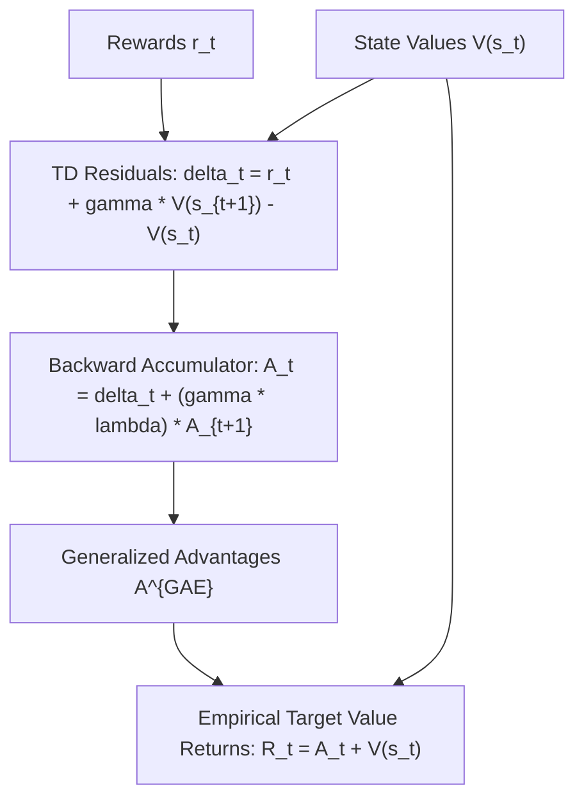

# genpark-gae-generalized-advantage-estimation-skill

Agent Skill implementing **Generalized Advantage Estimation (GAE-$\lambda$)** balancing bias and variance across temporal difference steps for Actor-Critic algorithms.

## Architectural Overview

